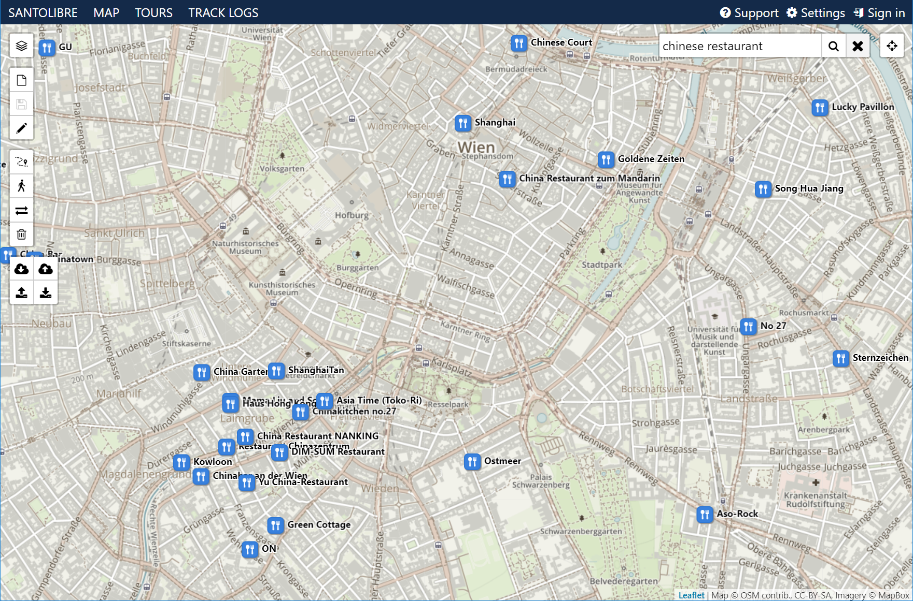

# map-search

A point of interest search service that uses OpenStreetMap data. It uses RavenDB for storing and searching the imported OSM data. Address geocoding is done with the MapQuest OSM API, but any geocoding provider could be used instead.

The POI search is based on OpenStreetMap tags and values, so the search terms have to be in English. A search for "table tennis" and "atm" will work, but a search for "Tischtennis", "ping pong table" and "cash dispenser" won't.

Because the service separates address and point of interest search, a special term has to be used to separate the two. Currently those terms are "near", "in" and "around".

## API

```GET https://search.map.santolibre.net/api/v1/search/[term]?latitude=[latitude]&longitude=[longitude]```

### Parameters

<table>
    <tr>
      <th>Parameter</th>
      <th>Description</th>
    </tr>
    <tr>
      <td>term</td>
      <td>The term is in the form <strong>What</strong> near|in|around <strong>Where</strong>.<br />If there is no <strong>Where</strong> part, latitude and longitude have to be specified to define the search location.</td>
    </tr>
    <tr>
      <td>latitude</td>
      <td><strong>Optional</strong> latitude of the search location</td>
    </tr>
    <tr>
      <td>longitude</td>
      <td><strong>Optional</strong> longitude of the search location</td>
    </tr>
</table>

### Response

```
{
  "radius": [search radius],
  "center": {
    "lat": [latitude],
    "lng": [longitude]
  },
  "locations": [{
      "id": [osm node id],
      "tags": {
        [tag key]: [tag value],
        [tag key]: [tag value]
      },
      "dateUpdated": [import date],
      "name": [name]
      "geoCoordinates": {
        "lat": [latitude],
        "lng": [longitude]
      },
      "category": [category],
      "type": [type]
    }
  ]
}
```

### Examples

Search for something at a specific address

```GET https://search.map.santolibre.net/api/v1/search/italian restaurant in luzern```

```GET https://search.map.santolibre.net/api/v1/search/table tennis near berlin```

Search for something at a specific location

```GET https://search.map.santolibre.net/api/v1/search/atm?latitude=51.511373&longitude=-0.119230```

## Cache utility

The cache utility requires osm data to be in the PBF format (http://wiki.openstreetmap.org/wiki/PBF_Format).

Downloading data 

```wget.exe --directory-prefix=C:\temp\osm http://download.geofabrik.de/europe/europe-latest.osm.pbf```

Importing data

```dotnet Santolibre.Map.Search.CacheUtility.dll --import=C:\temp\osm\europe-latest.osm.pbf```

Removing old data

```dotnet Santolibre.Map.Search.CacheUtility.dll --remove-older-than=7```

### Parameters

<table>
    <tr>
      <th>Parameter</th>
      <th>Description</th>
    </tr>
    <tr>
      <td>--import=[filename]</td>
      <td>Import a .osm.pbf file</td>
    </tr>
    <tr>
      <td>--remove-older-than=[days]</td>
      <td>Remove data older than number of [days]</td>
    </tr>
    <tr>
      <td>--analyze-index-terms</td>
      <td>Shows how many times index terms are referenced by points of interests</td>
    </tr>
    <tr>
      <td>--compact-database</td>
      <td>Compact the database</td>
    </tr>
</table>

## Demo service

The search service is running on https://map.santolibre.net, but we warned that the server is not very fast.

The following screenshot shows [chinese restaurants in Vienna](https://map.santolibre.net?search=chinese%20restaurant%20in%20vienna)

